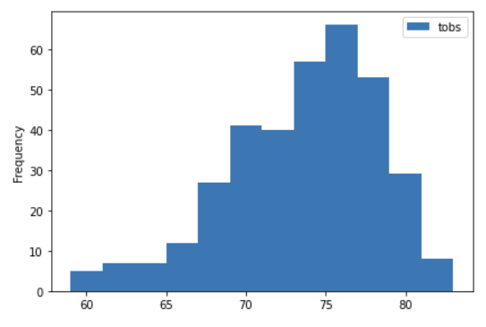

# Surfs_Up

## Project Overview

To build a surf and shake shop in Oahu, Hawaii, I needed to secure investors. 
One investor, W. Avy said he would not invest until I showed him data proving that Oahu is the perfect location for a shake shack.

### Purpose

To reassure W. Avy, I analyzed weather data from Oahu, specifically looking at temperature trends for June and December, to determine if the surf and ice cream shop business is a sustainable business year-round.

## Resources

- Data Source: hawaii.sqlite
- Software: Python 3.7.7, Matplotlib 3.2.2, JupyterLab 2.1.5, Pandas 1.0.5, matplotlib 3.2.2, SQLAlchemy 1.3, NumPy 1.19
  
## Results

Summary statistics for temperatures in June:

Summary statistics for temperatures in Dec:

My analysis of summary statistics for temperatures in June and December shows three key differences:
   - The average temperature in June (74.9) is only about 3 degrees more than the average temperature in December (71).
   This shows that on average, the temperatures for both months are fairly similar.
   - As far as temperatures, June appears to be a hotter month than December.
   The minimum temperature for June temperature data from 2010-2017 was 64, higher than the minimum temperature from December data within the same timeframe, which was 56.
   - The maximum temperature recorded for the June data was 85, only two degrees higher than December's highest recorded temperature of 83.

## Summary
Percentiles from the summary statistics for June and December reinforce the observation in the results section of this write-up that June appears to be a warmer month than December, but the two months have a fairly similar temperature profile.

To build on my data analysis, however, I decided to focus on the station with the highest number of temperature observation data and then query and graph the last year's worth of temperature observation data to see how the data looks over one year.

As the histogram for data from one station with the highest number of temperature observations shows, temperatures for the last year ranged from around 59 degrees to about 83 degrees.
The frequency also reveals that temperatures tend to be around 75 degrees, which makes for wonderful surfing and ice cream weather -- not too hot and not too cold.

The summary table of last year's temperature data from one observation station backs up what I observed from the histogram.

Along with ideal temperatures, sunny weather is vital for the surfing and ice cream industry.
If there is too much precipitation, customers may want a bowl of clam chowder or a day in at their resort instead of a cone of cold ice cream or a quick surf through the waves.

Since I have not run any queries on precipitation data for this analysis, I decided to retrieve the last 12 months of precipitation data and plot the results.

As the graph of precipitation data from the last year shows us, precipitation changes depending on the month, but for the most part, precipitation appears to be fairly low. 

As the summary statistics of the precipitation data below show, the average precipitation for the previous year was 0.177, not particularly worrisome for my business proposal.
However, if investors are worried about months with greater precipitation, we can discuss potentially adding some indoor offerings to my shop.

The results of my study show data that backs up Oahu as the perfect place to surf (even in December) and therefore is the perfect location to open up a surf and ice cream show.